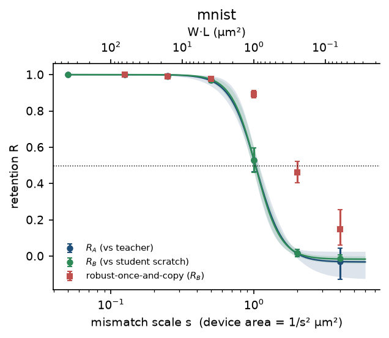
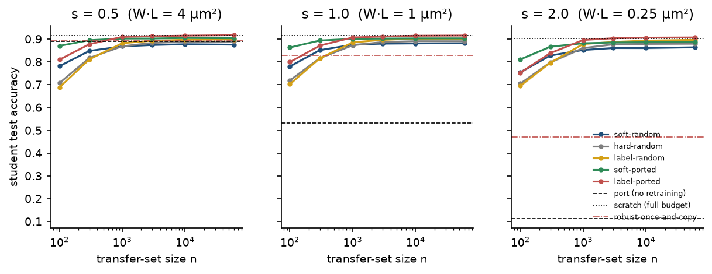
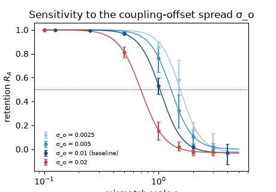
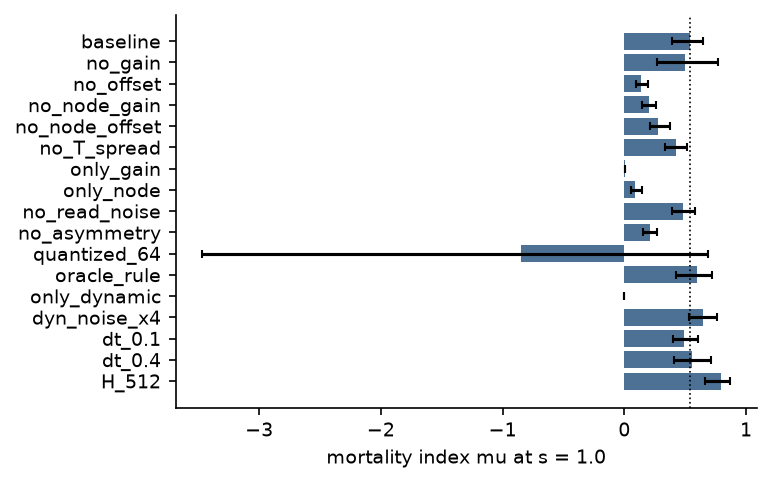

<h1 align="center">The Mortality Threshold Study</h1>

<p align="center">
  <b>Weight portability and output-only distillation between mismatched analog devices trained by equilibrium propagation</b>
</p>

<p align="center">
  
  
  
  
</p>

---

## Overview

Networks trained in situ on analog hardware adapt to the imperfections of the device they run on. Hinton's *mortal computation* builds on this: parameters are useful only on the device that learned them, and knowledge moves between devices by distillation instead of by copying weights.

This repository tests both halves of that idea in simulation.

1. **How fast do copied weights stop working** as device-to-device mismatch grows?
2. **Where does output-only distillation** (the student sees only the teacher's outputs, never its weights) **become better than copying**, and better than training one model to be robust to the whole device distribution?

The network is a layered nonlinear Hopfield-type model relaxed by overdamped Langevin dynamics at finite temperature and trained by symmetric equilibrium propagation. Devices are sampled from a mismatch model with a single scale `s` that multiplies all static spreads. Through Pelgrom's law, `s` corresponds to a device area of `1/s²` µm².

## Main results

| Finding | Result |
|---|---|
| Retention of above-chance accuracy after copying | 0.97 at s = 0.5, 0.53 at s = 1, 0.02 at s = 2 |
| Half-retention point (MNIST) | s½ = 1.03 [0.97, 1.09], Hill exponent 4.7 |
| Fashion-MNIST replication | s½ = 1.15 [1.06, 1.22] |
| Distillation vs. robust baseline, 100 unlabelled images, s = 2 | +0.32 accuracy [0.28, 0.37]; the robust baseline is slightly better below the threshold |
| Sensitivity to the least certain constant (offset spread, 8-fold range) | s½ between 0.70 and 1.54; exponent stays 4.3 to 4.9; the distillation crossover moves with s½ |
| Main cause of the loss | Coupling offsets; coupling-gain mismatch alone has almost no effect |
| Soft vs. hard targets and true labels | Soft targets win only for transfer sets of 300 images or fewer |

All intervals are 95% bootstrap intervals with devices (not images) as the unit of replication.

<p align="center">
  
  
</p>
<p align="center">
  
  
</p>

## Repository layout

```
src/
  substrate.py   energy function and Euler-Maruyama Langevin relaxation
  device.py      device sampler (static mismatch, drift exponents)
  eqprop.py      symmetric equilibrium propagation, programming model
  train.py       batched in-situ training and evaluation (vmap over runs)
  analysis.py    retention, Hill fit, two-way cluster bootstrap
  data.py        MNIST / Fashion-MNIST loading
tests/           validation tests V1-V8 and a leakage test
configs/         main.yaml (MNIST), fashion.yaml, smoke.yaml
run_study.py     train, port, readouts, distill, ablate stages (resumable)
run_sensitivity.py, run_sens_distill.py   offset-spread sensitivity experiments
make_report.py   regenerates tables and figures from results/
run_all.sh       full pipeline
results/         result tables (parquet), reports, figures, logs
```

## Device model

| Static, device-specific (multiplied by `s`) | Dynamic (fixed across `s`) |
|---|---|
| lognormal coupling gains | read noise per relaxation |
| additive coupling offsets | soft-bounded asymmetric weight updates |
| per-node gain, steepness and offset | programming and write noise |
| per-node temperature | conductance drift (drift experiment only) |

Only the programmed parameters `(W, b)` are copied between devices. Every device quantity stays with its device. The baseline values and their sources, or the fact that they are assumed, are listed in `src/config.py`.

## Validation

`tests/test_validation.py` must pass before any experiment:

- **V1, V2** copying to a zero-mismatch or same-seed device reproduces the teacher exactly
- **V3** the update matches the backpropagated gradient (cosine above 0.99 at T = 0, small β)
- **V4** noise-free relaxation lowers the energy monotonically
- **V5** harmonic test: sampled variance matches the exact Euler-Maruyama value
- **V6** device sampler passes Kolmogorov-Smirnov tests; `s = 0` gives the nominal device
- **V7** identical seeds give identical parameters
- **V8** estimator bias falls as β²
- a leakage test confirms the distillation code never receives teacher parameters

## Running

Requires Python 3.12 and, on CPU: `jax`, `numpy`, `scipy`, `pandas`, `pyarrow`, `matplotlib`, `pyyaml`, `tabulate`.

```bash
pip install "jax[cpu]" numpy scipy pandas pyarrow matplotlib pyyaml tabulate pytest

python -m pytest -q tests          # validation tests
bash run_all.sh                    # full study, about 10 hours on a 6-core CPU
```

Data: put `mnist.npz` in `data/`, and the four Fashion-MNIST idx files as `data/fashion-{train,t10k}-{images-idx3,labels-idx1}-ubyte.gz`.

Individual stages can be run on their own and resume from saved outputs:

```bash
python run_study.py configs/main.yaml train port readouts distill ablate
python run_sensitivity.py configs/main.yaml
python make_report.py configs/main.yaml configs/fashion.yaml
```

The full study (1832 training runs) took 10.5 hours on a six-core laptop CPU, plus about 4 hours for the sensitivity experiments. Trained weight files are not included; the result tables in `results/` are.

## Limitations

- Simulation only. The device model is calibrated to published subthreshold CMOS matching data, but several dynamic constants and the coupling offset spread are assumed. The device area at the threshold should be read as a range (0.4 to 2 µm²), not as a prediction for a specific process.
- Nominal accuracy is 0.915 on MNIST, limited by a training budget of about six epochs. All measures are normalised against the same conditions.
- One architecture (784-256-10). The ablation suggests larger networks lose portability sooner, which a size sweep would need to confirm.
- Distillation runs use one third of the scratch training budget.

## Author

Khalid Iqnaibi, Palestine Polytechnic University, Hebron, Palestine.
